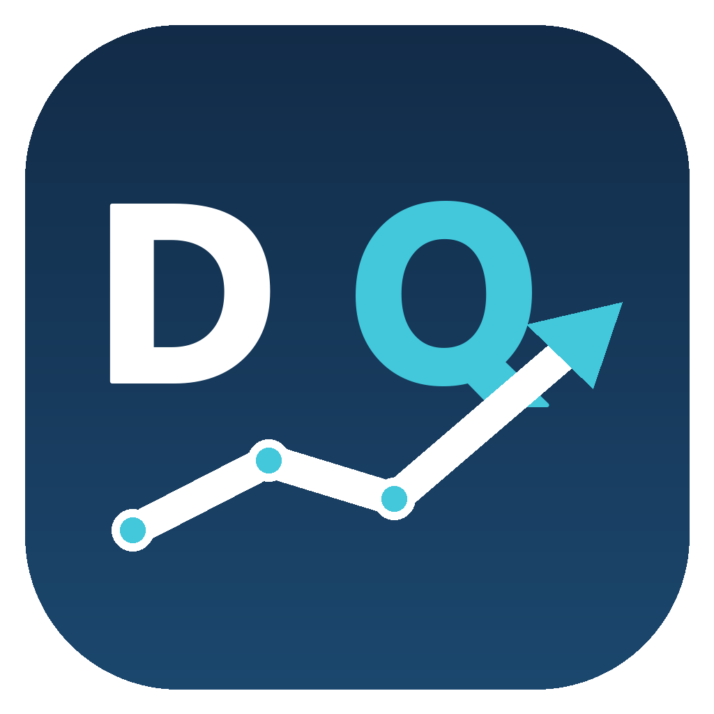

# DART-QoE

<p align="center">
  
</p>

<p align="center">
  <strong>공시 기반 정상화 이익·운전자본 검토 보조 도구</strong><br>
  Disclosure-Based Quality of Earnings Review Tool
</p>

DART 공시 재무제표와 사업보고서 원문을 이용해 인수 검토 대상 기업의 **이익 지속성, 현금전환, 운전자본과 순차입금**을 살펴보는 Windows 데스크톱 PoC입니다.

자동으로 정상화 이익이나 기업가치를 확정하는 프로그램이 아닙니다. 거래 검토자가 추가로 확인할 지표, 정상화 조정 후보, 공시 원문과 계산 근거를 빠르게 찾도록 설계했습니다.

## 프로젝트 목적

공시상 이익이 증가했더라도 그 성과가 지속 가능한 영업활동에서 발생했는지는 별도의 검토가 필요합니다. DART-QoE는 다음 질문에서 출발합니다.

- 이익 증가가 영업현금흐름으로 전환되고 있는가?
- 매출 증가보다 매출채권이나 재고가 더 빠르게 증가하고 있지 않은가?
- 손상차손, 처분손익, 정부보조금 등 반복 가능성이 낮은 항목이 포함되어 있지 않은가?
- 현금과 차입금을 함께 고려한 실질적인 자금 상태는 어떻게 변했는가?
- 계산 결과를 어떤 공시와 계정에서 가져왔는지 다시 확인할 수 있는가?

이 프로젝트는 `한화–대우조선해양 M&A 사례 분석 → DART-QoE 거래 검토 방식 구현 → DART-OT 이자비용 감사 검토`로 이어지는 포트폴리오 흐름을 목적으로 합니다. 실제 거래실사 수행 경험이 아니라, 공시자료를 활용해 거래 검토 사고방식을 구현한 개념검증입니다.

## 주요 기능

### 1. 보고이익과 현금전환

- 매출액 또는 영업수익
- 매출 성장률
- 영업이익과 영업이익률
- 영업활동현금흐름
- 영업이익 대비 영업현금흐름
- 순이익과 영업현금흐름의 괴리

화면 요약에는 비교 기준을 명확히 하기 위해 `2021년 금액 → 2025년 금액`처럼 연도와 값을 함께 표시합니다.

### 2. 운전자본

- 매출채권회전일수
- 재고자산회전일수
- 매입채무회전일수
- 현금전환주기
- 순운전자본
- 매출 대비 순운전자본
- 매출채권·재고 증가율과 매출 증가율의 차이

### 3. 순차입금

- 차입금과 사채
- 현금및현금성자산
- 리스부채 포함 여부 선택
- 연도별 순차입금 추이

현재는 영업이익 기준 PoC입니다. 감가상각비와 무형자산상각비의 안정적인 추출을 추가한 뒤 EBITDA 및 순차입금/EBITDA 분석으로 확장할 예정입니다.

### 4. 정상화 조정 검토 후보

다음 5개 유형을 재무제표 계정명과 사업보고서 원문 키워드로 탐색합니다.

1. 유형자산 처분손익
2. 손상차손과 충당부채
3. 소송·재해 등 사건
4. 정부보조금
5. 관계기업·중단영업·대규모 기타손익

탐지된 항목은 **확정 조정액이 아니라 확인이 필요한 후보**입니다. 금액의 중요성, 반복 여부, 거래 맥락과 주석 원문을 사용자가 직접 검토해야 합니다.

Excel의 `검토 후보` 시트에서 사용자가 다음 항목을 입력하면 `정상화 손익` 시트와 `QoE 요약`이 자동으로 다시 계산됩니다.

1. 조정 여부: `예` 또는 `아니요` 선택
2. 적용 금액
3. 조정 사유

계정명과 원문 키워드에 따라 손익 구분을 `일회성 이익`, `일회성 손실`, `확인 필요`로 표시합니다. 조정 여부가 `예`이면 일회성 이익은 보고 영업이익에서 차감하고 일회성 손실은 가산합니다. `확인 필요` 항목은 잘못된 방향 반영을 막기 위해 자동 계산에서 제외하며, 자동 추출 금액은 사용자가 확인할 참고값입니다.

### 5. 검토 흔적

결과 엑셀에 다음 정보를 남깁니다.

- 사용한 사업보고서와 접수번호
- DART 원문 주소
- 연결·별도재무제표 기준
- 원천 계정과 자동 추출 여부
- 지표별 계산식
- 검토 상태
- 사용자 조정 여부와 사유
- 연도별 추출 오류와 제한사항

## 분석 범위

- 국내 DART 공시 대상 상장사
- 회사명 또는 종목코드 검색
- 분석기간 자유 설정
- 기본 분석기간: 2021~2025년
- 연결재무제표 우선
- 연결 자료가 없으면 별도재무제표로 자동 전환
- 연도별 기준이 다르면 혼합 기준으로 표시
- 사업보고서 원문 후보 탐색 여부 선택
- 순차입금 계산 시 리스부채 포함 여부 선택

제조업 상장사를 우선적인 테스트 대상으로 삼았지만, 계정 구조가 다른 바이오·연구개발 기업 등도 분석할 수 있습니다. 이 경우 `매출액` 대신 `영업수익`이 선택되는 등 회사별 표시 계정과 사업 특성을 함께 확인해야 합니다.

## 사용 방법

Windows 배포본에서는 `DART-QoE.exe` 하나만 실행합니다. 브라우저나 로컬 웹 서버를 사용하지 않는 독립형 데스크톱 프로그램입니다.

1. OpenDART 인증키를 입력합니다.
2. 회사명 또는 종목코드를 입력합니다.
3. 분석기간을 선택합니다.
4. 리스부채 포함 여부와 원문 후보 탐색 여부를 선택합니다.
5. `분석 및 엑셀 생성`을 실행합니다.
6. 화면에서 핵심 지표와 추가 확인 포인트를 확인합니다.
7. 생성된 Excel의 `검토 후보`에서 조정 여부·적용 금액과 사유를 입력합니다.
8. `정상화 손익`과 `QoE 요약`에서 사용자 조정 후 결과를 확인합니다.

결과 파일은 실행파일과 같은 위치의 `outputs` 폴더에 저장됩니다.

### 인증키 저장

`이 PC에 암호화하여 저장`을 선택하면 인증키는 `%APPDATA%\DART-QoE\api-key.dat`에 저장됩니다.

Windows DPAPI를 사용하므로 저장된 값은 현재 Windows 사용자 계정에서만 복호화할 수 있습니다. 인증키 원문을 프로젝트 파일이나 결과 Excel에 기록하지 않습니다.

### 실행 안정성

- 프로그램은 Windows 세션에서 한 번에 하나만 실행됩니다.
- 실행 중 다시 열어도 중복 창을 만들지 않습니다.
- PyInstaller 임시 압축 해제 충돌을 방지하기 위해 패키지 실행파일의 자기 업데이트 기능은 사용하지 않습니다.
- 새 실행파일 배포 시 기존 앱을 종료한 후 파일을 교체하고 다시 실행합니다.

## 화면 결과

분석 완료 후 화면에는 세부 표 전체가 아니라 의사결정에 필요한 요약을 표시합니다.

- 분석기간과 재무제표 기준
- 추출 오류 또는 제한사항
- 시작연도와 종료연도의 매출·영업이익률 비교
- 최근 연도 영업현금 전환율
- 최근 연도 매출 대비 순운전자본
- 최근 연도 순현금 또는 순차입금
- 정상화 조정 검토 후보 수
- 정상화 손익 계산 방법 안내
- 추가 확인이 필요한 지표

화면은 빠른 검토용이며, 세부 내용의 기준 문서는 생성된 Excel입니다.

## Excel 구성

| 시트 | 내용 |
|---|---|
| `표지` | 분석 목적, 회사, 기간, 재무제표 기준, 단위와 사용 순서 |
| `원천 자료` | DART 재무제표 추출값, 추출 기준과 사용자 메모 |
| `QoE 요약` | 보고 영업이익과 사용자 조정 후 정상화 영업이익, 현금전환과 순차입금 |
| `정상화 손익` | 일회성 손익 자동 구분, 가산·차감 조정액, 정상화 영업이익과 이익률 |
| `운전자본` | 회전일수, 현금전환주기, 순운전자본과 검토 포인트 |
| `순차입금` | 현금·차입금·리스부채 구성, 순차입금·순현금과 전년 대비 증감 |
| `검토 후보` | 유형, 계정·키워드, 금액, 원문 발췌와 사용자 판단란 |
| `검토 흔적` | 사용 공시, 접수번호, 원문 주소, 재무제표 기준과 산식 |
| `검증` | 데이터 완전성, 연결 기준 여부, 오류와 제한사항 |

## 주요 산식

| 지표 | 산식 |
|---|---|
| 영업이익률 | 영업이익 ÷ 매출액 |
| 영업이익 대비 영업현금흐름 | 영업활동현금흐름 ÷ 영업이익 |
| 순이익–영업현금흐름 괴리 | 순이익 - 영업활동현금흐름 |
| 매출채권회전일수 | 평균 매출채권 ÷ 매출액 × 365 |
| 재고자산회전일수 | 평균 재고자산 ÷ 매출원가 × 365 |
| 매입채무회전일수 | 평균 매입채무 ÷ 매출원가 × 365 |
| 현금전환주기 | 매출채권회전일수 + 재고자산회전일수 - 매입채무회전일수 |
| 순운전자본 | 매출채권 + 재고자산 - 매입채무 |
| 순차입금 | 차입금·사채 + 선택 시 리스부채 - 현금및현금성자산 |
| 정상화 순조정액 | 조정 여부가 `예`인 일회성 손실 가산액 - 일회성 이익 차감액 |
| 정상화 영업이익 | 보고 영업이익 + 정상화 순조정액 |
| 정상화 영업이익률 | 정상화 영업이익 ÷ 매출액 |

분모가 없거나 영업손실인 경우 일부 비율은 경제적으로 해석하기 어렵습니다. 특히 적자기업은 순차입금/EBITDA보다 현금 소진 속도와 순현금 비중을 함께 보는 것이 적절할 수 있습니다.

## 데이터 처리 흐름

```text
회사명·종목코드
        ↓
DART 기업 고유번호 확인
        ↓
연도별 연결재무제표 조회
        ↓ 연결 자료 미제공
연도별 별도재무제표 재조회
        ↓
사업보고서·원문 텍스트 수집
        ↓
재무지표 계산·검토 후보 탐색
        ↓
화면 요약 + 검토 흔적이 포함된 Excel 생성
```

## 기술 구성

- Python 3.12
- Tkinter 기반 Windows 데스크톱 UI
- Windows 네이티브 입력 컨트롤을 이용한 한글 IME 처리
- OpenDART REST API
- Node.js
- `@oai/artifact-tool`을 이용한 Excel 생성
- PyInstaller 단일 실행파일
- Windows DPAPI 인증키 암호화
- `unittest` 기반 계산·실행 검증

주요 파일은 다음과 같습니다.

| 파일 | 역할 |
|---|---|
| `app.py` | 데스크톱 UI, 인증키 저장, 화면 요약과 Excel 생성 실행 |
| `qoe.py` | DART 조회, 계정 매핑, 지표 계산과 후보 탐색 |
| `export_workbook.mjs` | 분석 결과를 검토용 Excel로 변환 |
| `scripts/build_exe.ps1` | PyInstaller 실행파일 빌드 |
| `test_app.py` | 화면 요약·실행 안정성 테스트 |
| `test_qoe.py` | 재무지표와 후보 탐색 테스트 |

## 소스 실행과 빌드

### 테스트

```powershell
python -m unittest -v
```

### 소스 실행

```powershell
python app.py
```

Python의 Tkinter와 Node.js, `@oai/artifact-tool`이 필요합니다. Node 실행경로는 `DART_QOE_NODE`, 패키지 경로는 `NODE_PATH`로 지정할 수 있습니다.

### Windows 실행파일 빌드

```powershell
powershell -ExecutionPolicy Bypass -File scripts/build_exe.ps1
```

빌드 결과는 프로젝트 루트의 `DART-QoE.exe`입니다. 현재 빌드 스크립트의 기본 런타임 경로는 Codex 작업환경에 맞춰져 있으므로 다른 PC에서 빌드할 때는 `-Python` 인수를 지정하고, Node·패키지 경로는 `scripts/build_exe.ps1`에서 환경에 맞게 조정해야 합니다.

## 현재 한계

- 공시 계정명이 기업마다 달라 계정 매핑 예외가 발생할 수 있습니다.
- 재무제표 API에서 제공되지 않는 주석 수치는 자동 추출이 제한됩니다.
- 키워드가 발견되었다고 해당 항목이 일회성이라는 의미는 아닙니다.
- 사업보고서 원문 HTML 구조에 따라 발췌 품질이 달라질 수 있습니다.
- 연결 자료가 없으면 별도재무제표를 사용하므로 분석 범위가 달라질 수 있습니다.
- 영업손실 기업의 현금전환율은 일반적인 양수 이익 기업과 동일하게 해석할 수 없습니다.
- 자동 산출 결과는 회계·투자 자문이나 실제 거래실사 결과가 아닙니다.

## 확장 계획

- 실제 선택된 공시 계정명을 화면과 검토 흔적에 더 명확히 표시
- EBITDA와 순차입금/EBITDA
- 순현금/총자산
- 적자기업의 현금 소진기간
- 정상화 조정 후보의 중요성 기준과 중복 제거
- 제조업·바이오 등 업종별 계정 매핑
- 테스트 기업별 회귀 검증 데이터셋

## 참고

- [OpenDART 공식 API](https://opendart.fss.or.kr/guide/main.do)
- [DART 전자공시시스템](https://dart.fss.or.kr/)

---

**BY JOONSEOK WON**<br>
Disclosure-Based QoE Review Tool
